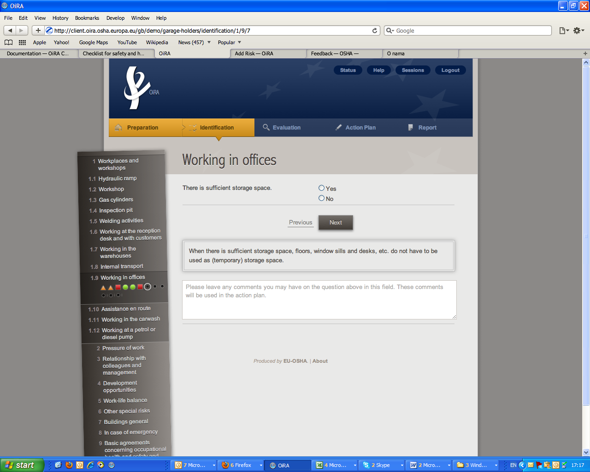

==========================================
A Guide to creating a Risk Assessment tool
==========================================

1.Introduction
==============

Your goal is to create the content of the OiRA tool for enterprises in your sector, and to offer this sector-specific tool to them.
The OiRA tool promotes a stepwise approach to risk assessment and is made up of 5 steps:

  * **Preparation** > the sector introduces the end-users (enterprises) to the risk assessment

  * **Identification** > the end-user goes through the hazards/problems and answers YES or NO
 
  * **Evaluation** > the end-users evaluate the risks for each problem/hazard spotted

  * **Action plan** > the end-user fills in an action plan with measures to tackle all stated risks	

  * **Report** > the Action plan becomes a report to be downloaded and printed

1.1 Keep in mind your end-user
------------------------------

It is important to **keep in mind your end-user: the micro and small sized enterprise (employer and worker(s) and the structure** of the risk assessment tool should be as relevant as possible to the daily activities of the enterprises; the end-user thinks and acts in terms of his own business processes.
Often, the expert’s way of thinking differs from the practice of the end-user. The latter thinks in terms of his own work processes and uses his own language. Some examples:

  * the expert thinks of physical workload; *the end-user of physical work*

  * the expert thinks of the thermal environment; *the end-user of working in the heat/in the cold*

  * the expert thinks of safety and creates a module containing everything in that area; *the end-user may think of opening and closing a shop, for example, and what that involves, or dealing with aggressive customers and what to do about them.* 

1.2 Use easy language
---------------------

**Structuring the content of the risk assessment tool so that it is in line with the way the average end-user thinks and acts** makes the content recognisable, and it makes it easier to carry out an action plan to tackle the risks with feasible measures.
  
Another decisive aspect is the language used. The **language** should be easy to understand with no need for interpretation, referring to things by names that are familiar and usual to enterprises.

Short sentences (at best no longer than ten words) and clear everyday language that can be easily read by the layman will prevent the end-user from developing an aversion, and enable him to draw up an assessment and use the OiRA tool properly.

At the beginning of the tool you will be given the chance to write a short introductory text sending a positive **and encouraging message** regarding:

  * the **importance** of risk assessment

  * the fact that risk assessment is **not necessarily complicated** (the idea is to contribute to demystify risk assessment)

  * the fact that the tool has especially been conceived to **meet the needs of the enterprises** in the sector 

It is important that the text is not too long; otherwise it could discourage the end-user from using the tool.

2.Team
======

Although it is important to keep the project team manageable in terms of size, it should preferably consist of:

  * representative(s) of the trade association(s)

  * representative(s) of the trade union(s)

  * the OiRA developer
 
  * an expert in occupational safety and health  (with knowledge of and affinity with the sector)

  * end-users

    * a few sector members: management or staff from companies

    * a few company employees, e.g. trade unions officials

3. Structure
============ 

3.1 Structure the content hierarchically
----------------------------------------

Before you start creating an OiRA tool, we recommend considering the number of matters which you want to address. Thorough consideration of the structure will pay dividends later on, so classify the subjects in a way that is relevant to end-users. 

The system offers a way to group topics, subtopics and types of risks together. The main goal of this grouping is to make it easier/more logical for the end-user to complete the risk assessment tool. Your risk assessment tool will therefore consist of:
 
 
.. image:: images/creation/module.png 
  :align: left
  :height: 32 px
  
**MODULES** = subjects  (locations, activities, …)
  
  *Example*: 
    Module 1: *Hair Shampooing*  (hairdresser sector)
  
  .. image:: images/creation/submodule.png 
    :align: left
    :height: 32 px
    
  **SUB-MODULES** (not compulsory) = sub-subjects
  
    *Example*: 
      Sub-module 1: *Working posture*
      
      Sub-module 2: *Contact with water and cosmetic products *
    
    .. image:: images/creation/risk.png 
      :align: left
      :height: 32 px
      
    **RISKS** = statements about a situation which is in order
    
      *Example*: 
        *1.1 The shampoo station is adjustable*
        
        *2.1 Suitable protective equipment, such as disposable safety gloves, is purchased*
      
      .. image:: images/creation/solution.png 
        :align: left
        :height: 32 px
        
      **SOLUTIONS** = preventive measures to solve the problem recommended by the expert
      
        *Example*: 
          *1.1 Taking regular breaks to be able to recover from physical work*

          *2.1 Using dust-free products*

The system also offers the possibility to:

  * skip one/a whole set of modules in case the content does not apply to the company activity (this feature is called “Optional profile question”)

  * repeat some modules in the case of enterprises having multiple locations (this feature is called “Repeatable profile question”).

3.2 Think about the risk as a positive statement (proposition)
--------------------------------------------------------------

Once you have decided about the main structure of the risk assessment tool you can start to identify and explain the various risks.
 
The system works with **positive statements or propositions** and not with questions about risks; that is, it states **whether a situation is ‘in order’ (the goal to be attained) or ‘not in order’;**
 
 .. example:

   Example: *Good lighting is present.*

The end-user answer is either a clear ‘yes’ or ‘no’. If the end-user answers with NO (= the situation is not in order), then the problem (= the negative description of the “situation in order”) is automatically included in the “Action plan” step and the end-user will have to propose a measure to tackle the risk.

3.3 Consider the different types of risks
-----------------------------------------

You can choose from 3 types of risks (positive statements):

  * top 5 risk: refers to a risk considered by the sector to be among the top 5 in the sector. 

    .. example:
    
      Example: *Working at height in the construction sector: The scaffold is erected on a firm foundation*

  * risk: refers to statements related to the existing risks at the workplace or linked to the work carried out. As for the previous type (top 5), to identify and evaluate such risks it is often necessary to examine the workplace (to walk around the workplace and look at what could cause harm; consult workers,  …).

    .. example:

      Example: All office chairs are adjustable

 * *policy*: refers to agreements, procedures, and management decisions regarding OSH issues. These statements can be answered from behind a desk (no need to examine the workplace). 

    .. example:
    
      Example: Manufacturers are regularly asked about alternative safe products 

We recommend to group the policy statements in separate modules. 

3.4 Pre-set evaluation for the risk
-----------------------------------
 
For each “risk” type you can choose from 2 evaluation methods:

  * **Estimated**: select the **default priority (high, medium** or **low**) that will appear to the end-user in the evaluation step) or to leave the "no default" option (this means that you don't give directions to the end-user in the evaluation step). 

  * **Calculated**: select the default **probability, frequency** and **severity**. The OiRA tool will automatically calculate the priority using a predetermined logarithm. You can also choose the "no default" options.

The end-user will nevertheless always be free to overrule your estimation.

Evaluation doesn’t have to be set for the following risk types and also end-users will not have to evaluate them in the “Evaluation” step:

  * Top risks (considered by default as "high priority" and displayed as “high” in the Action Plan)

  * Policy (strictly speaking this is not a risk)

3.5 Propose solutions
---------------------

The sector is generally well-informed of the risks that are most likely to lead to occupational accidents and diseases. In order to help the end-user to find solutions to these risks, you can include the solutions recommended by the sector/experts.  While working on the Action plan, the end-user will have the possibility to select the solutions and rework them (modify the text) according to the situation that prevails in their enterprise.

.. note::

  All the necessary documents are available on the OiRA community site http://www.oira.osha.europa.eu/documentation
