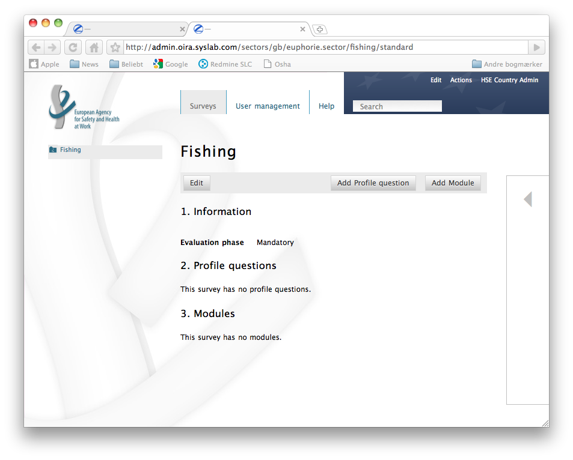
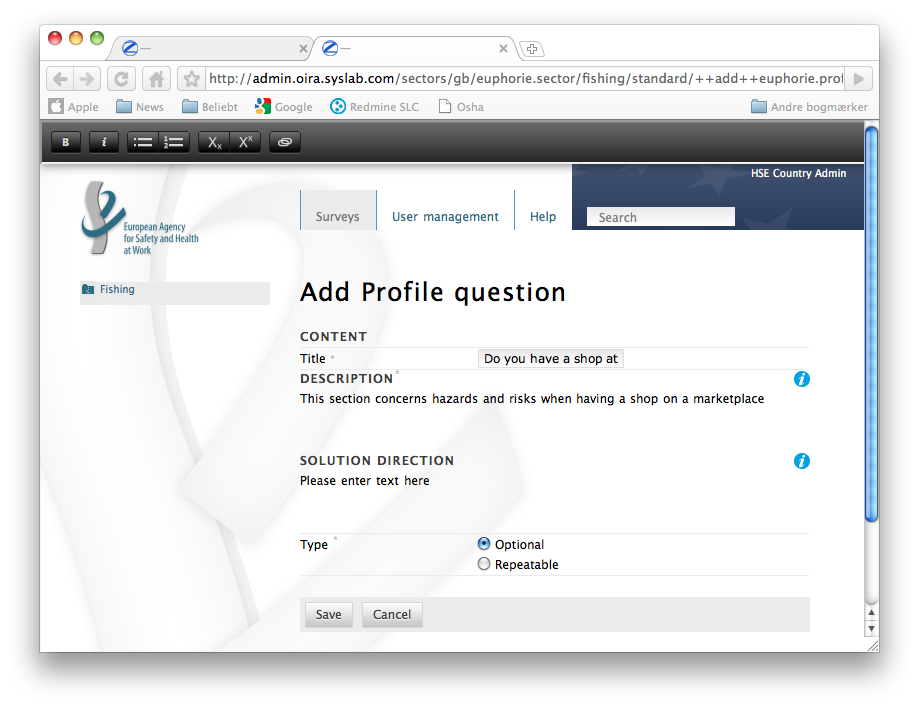
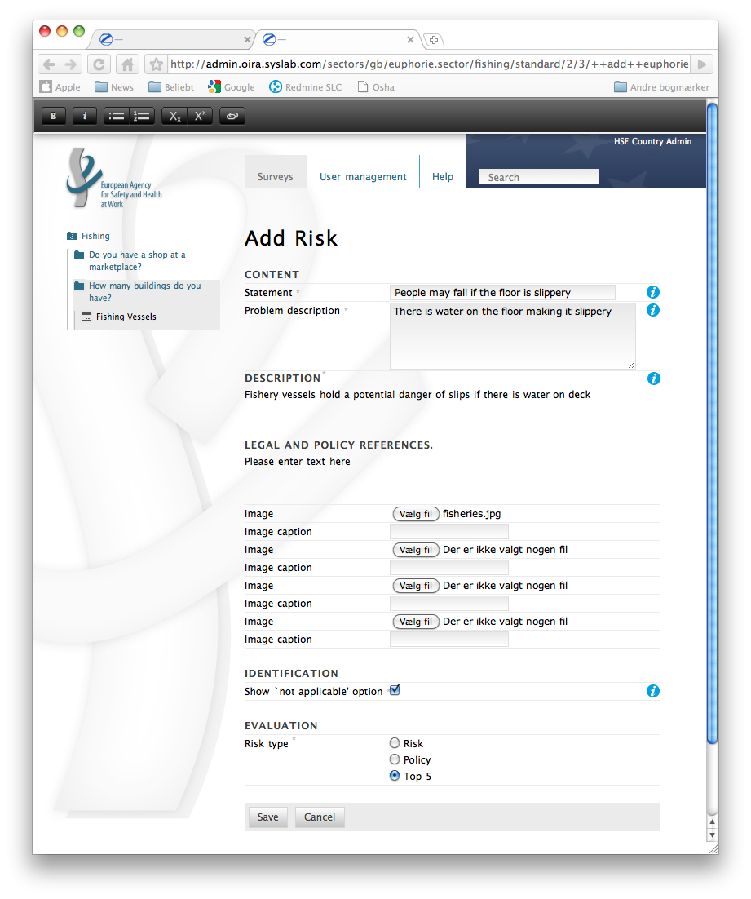
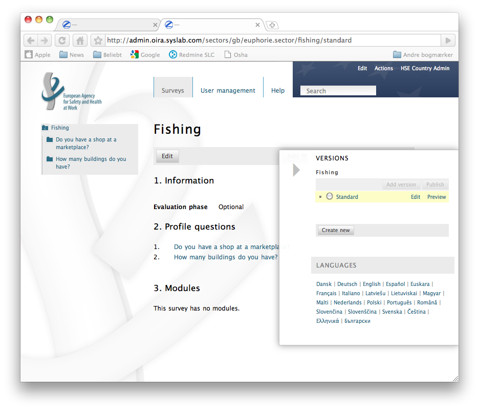

Content editor manual
=====================

This section explains how to create an online survey with modules and questions on risks.
This document assumes that you have some experience with OSH related terminology and that you have taken a look at the available general documentation, especially the document `Guide to create a risk assessment tool`_, which describes the overall process.

.. _Guide to create a risk assessment tool: http://www.oira.osha.europa.eu/documentation/welcome-package/guide-to-create-an-oira-tool/view

To create a survey, you will perform the following steps:

* Add a survey (you can have several surveys)
* Add profile questions to your survey
* Add modules to your survey
* Add Risks to your modules
* Publish your survey

After those steps, your survey will be available in `the online client`.

.. _the online client: http://client.oira.osha.europa.eu

Later you can 

* Add a survey version (surveys should be revised periodically, you can preserve old versions)
* Add additional surveys

Add a Survey
------------

We will now step through the process of creating an online survey. We will use an example for Bakeries which contains question on bakery typical risks.

Add a new survey:

* Hover your mouse over **Actions** and in the section **Add new** click **Survey**
* Provide a **Title** for the Survey, i.e. "Bakeries"
* Select if you want to **start from scratch** or **base your survey on an existing survey of another organisation**
* If you select to base on an existing survey, the form will extend and allow you to pick a survey by specifying country, sector and survey as well as the revision to copy
* Click **Save changes**

**Note**: If you start from scratch, you will create an empty survey and you can add the structure by yourself.
If you copy an existing survey, you will get a full previously created survey and you can change it according to your needs. If there is an existing survey that is very similar to yours, picking it as template may save you a lot of time.

.. image:: images/editor/editor_add_survey.png

If you for now choose to create an empty survey, you will be directed to the survey overview page.  

The system has automatically created an initial version for you and it is called **standard**. Read more about versioning in the section below. You might want to check additional settings of your survey version by clicking the **Edit** link. Here you can change Title, Description, Introduction Text, Language and Classification Code. You can also configure if the Evaluation may be skipped.

Add profile questions
---------------------

This section covers:

* Establishing a profile in the tool. 
  A profile determines which modules the user of the RA tool will deal with depending of his specific situation (Optional modules)
* Being able to indicate multiple locations for one company. 
  This option allows profiles to be created for each location (Repeatable modules)

A **profile** can be regarded as a **container for modules**. In contrast to **general modules** of a survey, *modules inside a profile* are only shown to the user, if he has indicated that they are applicable to his situation.

We will now add a **profile question**. You can add a **profile question** directly to an exsting version of your survey. 

**Note**:
Profile questions are only added directly to the survey root.

* Click the button **Add Profile Question** or use the **Actions** menu
* Specify a **title** (e.g. "Do you have a shop?")
* In the **description** you can add any relevant information on risks in relation to 
  having a shopthat may be helpful for the users. E.g. *This section concerns hazards and risks when having a shop*
* You can add a **solution direction** in the edit form below. This information will then be 
  shown to users, when they enter this module while working on the action plan.
* Specify the **Type** of the question. In this example choose **Optional**
* Click **Save**

**Note**: When you are editing rich text fields, you can do basic formatting using the format bar at the top of the browser viewspace. It allows you to format text bold and italic, use bullet and numbered lists, super- and subscript and to add links.

Within that profile question, you can now add Risks and Modules. These will only be shown to the user, if he as deemed them as applicable to his situation by answering positive on the profile question.

The Optional Profile
--------------------

The Optional Profile allows to filter out modules that are not applicable to a company.
When using a profile question, you examine various aspects of companies and the activities, in which they may be involved. The end-user of the tool answers a number of questions before actually applying the tool. The answers to these questions determine, which modules the end-user will and which modules he will not be dealing with. 

Here is an example from the fish retail trade:

* Do you have a shop?
* Do you have a stall on a market?
* Do you have a mobile sales vehicle?

Similar situations may occur in the sector, where you work. It may also be the case that some of the companies transport their goods to their clients themselves, while others contract such activities out to third parties.
Working out in advance, whether a profile is relevant means that the end-user does not have to deal with modules that do not apply to his company.

In this regard, Optional Profiles are similar to **Optional Modules** (see below). The difference is that a profile can only exist in the root of a survey.

**Example**: We would create the assessment of a shop as an optional profile, because a company might or might not be operating a shop.

The Repeatable Profile
----------------------

The Repeatable Profile allows to model a company with multiple geographical locations.

If it is a characteristical feature of an industry that companies have multiple locations of operation, then it is sensible to indicate this in the instrument beforehand. By referring to the locations by name (e.g. center shop, west-end outlet), the end-user can then group together his location-based risk assessments in one complete risk assessment. When filling out the survey, the user will then get the applicable modules repeated for each location. 

**Example**: We create a Repeatable Profile for **Storage rooms**, as a company might have more than one storage room to assess. This profile then contains all storage room relevant questions. A user with 3 storage rooms will get three modules with storage room relevant questions to fill in.

Profile Questions in the client
-------------------------------
XXX TBCompleted with images (Set up the survey, shoot edit form and user view)

This section shows how the use of Profile questions influences the structure of a survey.

The user sees the question "Do you have a shop?" and can indicate via a checkbox if this is the case.
The user can enter as many locations for their storages room as needed. All Modules and Questions of this Profile will be repeated for every location.
Example: The user indicates that they have a shop, and inserts the names of two locations for their storage room (in "Baker Street" and "Main Street")

The optional Profile "Do you have a shop?" and all modules contained are shown.

The repeatable Profile "Storage room" and all modules contained is shown, first for the room in "Baker Street",

then for the room in "Main Street".
If the user does not tick the checkbox for "Do you have a shop?" and does not insert any storage room name, only those modules that are not part of any profile are shown. In this example, this is only the module called "General module":

Adding Modules
--------------

In their function as containers for risk questions, you can use modules to group your questions logically. 

Modules can also be configured as optional. This allows the user to skip a whole module, in case its contents do not apply to the user's situation. When starting a new module, the user is asked a question. If the answer to the question is ‘no’, then the subsequent questions in the module are not displayed.

An example of a such a question is, ‘Is there a warehouse or storage area present’.
This prevents the end-user from having to answer questions in modules that are not relevant to his company. 

Modules can be added:

* directly to an exsting version of your survey (always present)
* to a profile (present only if the user has indicated that the profile is relevant for his situation)
* to another module to create a deeper structure

In this section we will add and configure a module and add risk questions to it.  We will start by adding a module to our existing survey version.

On the survey version overview form, click the button **add module** or use the **Actions** menu.

The **Add Module** form shows

* Specify a **title** for the module (e.g. "Work with customers")
* As **description** you can add any relevant information on risks relating to work with customers that may be helpful to describe the scope of this module
* Select if **this module is optional**
* If the module is optional you must add a **question**. This has to be a yes/no question, e.g. "Working with customers is done?"
* You can **upload an image** for this module, it will be displayed on the module overview. Click *Browse* and add the image from your own PC. Make sure that the image is big enough, but not too large an area (not larger than approximately 300 x 300 pixels on the screen) and in a maximum file size of 100 kB. Give the image a clear file name that does not contain spaces, e.g. Fisheries_vessels_logo.jpg.
* You can add a **solution direction** in the edit form below. This information will then be shown to users, when they enter this module while working on the action plan.
* When done, click **Save**

.. image:: images/editor/editor_add_module.png

Now you have added a module. A module can not only contain questions on risks, but also sub-modules.
You can add risks and submodules by clicking on the **Add Risk** and **Add Module** buttons. You can also still change the module itself by clicking the **Edit** button.

Example using submodules
------------------------

By using main modules that contain sub-modules you can modularise your survey further and provide more structure. What matters is that you make it easy for the end-user to complete the tool by grouping thematically related risk questions in modules. Submodules work exactly as modules and can also be optional.

A possible use of modules and submodules could be:

* Main module: Building

  * Sub-module: Every building

    * contains questions on all buildings in general

  * Sub-module: Some buildings: Public in the building

    * Optional: The public is received in the building: yes/no
    * Contains questions regarding receiving public

  * Sub-module: Some buildings: stairways, escalators, lifts

    * Optional: There are stairways, escalators, lifts in the building: yes/no
    * Contains questions regarding those subjects

  * Sub-module: Some buildings: kitchens

    * Optional: There are kitchens present in the building: yes/no
 
    * Contains questions regarding kitchens

* Next Main module: ...

Risks
------------

Once you have added a module, you can add risks to that module. The structure and content of risks vary and must be treated differently. 

Type of risks
-------------

There are different types of risks:
  
  * Risks
    These are related to the existing risks at the workplace or linked to the work carried out. To     identify and evaluate such risks it is often necessary to examine the workplace (to walk around the workplace and look at what could cause harm; consult workers).
  * Policy or desk risks. 
    These risks are related to agreements, procedures, management decisions regarding OSH issues. These statements can be answered from behind a desk (no need to examine the workplace).
  * Top 5 risk 
    This is a risk of which the social partners decided that it is an important risks in the sector.

Evaluationmethod
----------------

Policy or desk risks and Top 5 risks.
The end user does not have to evaluate these risks. They are automatically set on priority high. 
Risks (related to the workplace): you can choose several options:

  * Either calculated: the end user has to evaluate the dangers (risk = probability x severity x exposure).
  * Or estimated: the end user can make an estimation of the existing risk. Useful when you think the end user is not able to know how to perform it.
 
You can also select default priority: you help the end user by evaluating or estimating some or more the risks yourself. The end user is able to change the set priority. 
And it is possible to choose that the end user does not have to evaluate or estimate at all, he can do it but is able to skip it.
Whatever you choose over here: the end user is able to overrule the priority you gave to a subject in the Action plan.

Default priority
________________

You can select default priority: you help the end user by evaluating or estimating some or more the risks yourself.The end user is able to change the set priority.

Adding a Risk
_____________

To add a Risk, click the **Add Risk** button or use the **Actions** menu.The Add Risk form opens.

* Add a **statement**
  This has to be a short statement about a possible risk. e.g. "Attention is paid to avoid physical strengh (un) loading ovens" 
* Give a short **problem description** of a current (bad) situation, e.g. "No attention is paid to avoid physical strengh (un) loading ovens".
* Give a full **Description** of the risk including any relevant information that may be helpful for users, e.g. "Loading and unloading ovens can lead to overhead lifting of weights, undesirable rotation of the body while lifting weights, an undesirable back position".
* In the **Legal and policy references** text box you can describe, and optionally link to, any laws and policies that are relevant to your risk. You can state the name and number and suchlike of the law or directive that relates to the risk. If necessary, you can place the actual text of the law (preferably not too long) in the text box.
* You can upload up to 4 **images** which will be shown in the risk description. You can use them to show wrong and right situations. Make sure that the image is big enough, but not too large an area (not larger than approximately 300 x 300 pixels on the screen) and in a maximum file size of 100 kB. Give the image a clear file name that does not contain spaces (e.g.: Hazard_situation_bad.jpg).
* Under **Identification** you can select if the user will be able to mark this risk as "not applicable" for his situation.
* In the **Evaluation** section, you define the **Risk Type**

  * Choose **Risk** if it should be evaluated as risk. In this case you have to specify additional parameters

    * The **Evaluation method** specifies if the risk should be estimated or calculated

      * **Estimated** will give the user the option to select between *Low*, *Medium* and *High*. You can define if one of these three options should be prefilled by selecting it here. Keep it on "No default" to leave it to the user to actively select one option.
      * **Calculated** will give the user the option to select between three options each for *Probability*, *Frequency* and *Severity* of the risk. This will be used to calculate the risk based on the Kinney method. You can define if one of these three options each should be prefilled by selecting it here. Keep it on "No default" to leave it to the user to actively select the option.

  * Choose **Policy** if the risk question is about a policy

  * Choose **Top 5** if the risk is considered one of the top risks in this context. 

  In this example we choose risk as the risk type and select calculated as evaluation method. The deafault probability is set to "medium", default frequency to "regularly" and default severity to "significant severity".

* When done, click **Save**

You have added a risk to your module. Continue adding risks until your module is completed. Then continue adding more modules until the survey is completed.

Add a Solution
--------------

You can add possible solutions to risks. If chosen, these will later show in the users action plan. To add a Solution, click the **Add Solution** button while viewing a risk or use the **Actions** menu. The Add Solution form opens.

* Add a **Description**. Include here any information that might be relevant for the user, e.g. "Buy deck ovens with which workers do not need to lift weights because the ovens and the means belonging to the oven prevent lifting weight over head. Of course that in most instances will not be possible because of the investment needed. But if you are buying new deck ovens (or replace them) think of preventing disorders of workers and what that will cost."
* In **Action Plan**, describe the action that can be taken to remove this risk, e.g."When we buy or replace deck ovens we additional need occupational safety and health requirements, thus preventing workers developing disorders and the human/financial costs belonging to that." 
  This information will be copied to the measure.
* In **Prevention Plan**, describe what can be done to prevent this risk from (re)occuring, e.g. "Take up contact with the people who are responsible for buying and replacing deck ovens so they – in future – know what additional criteria should be used." 
  This information will be copied to the measure.
* In **Requirements**, describe the standard requirements for the action plan and for the prevention plan, e.g. "Knowledge of what kind of postures can lead to disorders with workers."  
  This information will be copied to the measure.

The solution will appear on the risk view below the risk information.

Notes on using the graphical editor
-----------------------------------

In some of the large text boxes you can format your text. This is possible using a toolbar at the top of the browser's viewport.

The format toolbar has the following options:

* **Bold**: Select a piece of text (using the mouse) and click **B** in the format toolbar above the text box. Selecting the same piece of text again and clicking B again removes the bold effect (this method also applies to all other types of formatting).
* **Italic**: Select a piece of text (using the mouse) and click ***i*** in the format toolbar above the text box. NB: Italic text on a monitor is not always easy to read.
* **Bulleted list**: Select the lines required and click the icon with the three square blocks. 
* **Numbered list**: Select the lines to be numbered and click the icon with 1–2. 

* **Hyperlink** (to a website): First type the text with which you wish to associate the link, e.g. the text: ‘See also this website’ Next you select this text using the mouse. Then you click on the chain icon in the formatting toolbar. A new screen opens. You fill in the web address below (next to ‘link the highlighted text to this URL’). This must begin with http:// . Provide a Title and select if the link should open in a new window. Then click ‘Save’. The link appears as underlined text. 
  NB: URLs are the way to refer to documents that you want to add to the survey, such as example plans, example texts, collective agreements etc. You place these documents on a website and then make a link to them from the survey.
* **Modifying or removing hyperlinks**: By clicking on the underlined text once again you can modify the link via the chain icon or remove the link again.

Click the button **Save** (bottom left) when you have finished. This returns you to the previous screen. The yellow status bar notifies you that the model has been changed, in other words the data has been stored.

Survey Versions
---------------

The risk assessment tool allows you to store several versions of your survey and manage these versions. You can manage survey versions using the Version drawer on the right side of the browser window. It is hidden by default and appears when you hover your mouse over the grey triangle.

Here you can always also create a new survey. 

* Click the **Create new** button
* Provide a **Title**
* Select how you want to start the survey.
  * You can create a new survey from scratch
  * You can use an existing survey from your organisation as template
  * You can use an existing survey from another organisation as template
* Select your preference and click **Save changes**

The newly added survey will appear in your version drawer and by clicking the **edit** link you can start working on it.

To add a version to your survey, open the versions drawer. Here you can see your initial standard version and any other versions that you have created so far. Beside each survey version you can find the links **edit** and **preview**. While **edit** directs you to the edit form for this survey version, **preview** will get you to the client interface of this version, so that you can test how it will look like for the end users.

Before end users can use your survey, you must publish it. 

* Mark a survey version
* Click **publish**

Now your survey will be accessible by the public.

A survey should be revised periodically, usually to adapt it to the latest changes in legislation or other environmental changes. This is supported through versions of a survey, so that you can keep your old versions while you only publish the one that is most up to date. Updating an existing survey version usually means to only do minimal changes to adapt it to latest amendments in legislation or new findings. In this case you don't want to create a new survey version but instead copy the old one and make amendments.

* Mark a survey version
* Click the **Add version** button.
* Provide a Title
* Make sure the correct base revision is selected
* Click the **Create** button.

Now you have a second survey version available and you can work on this one. Once you are done, you can publish it and it will replace the existing survey.

 
