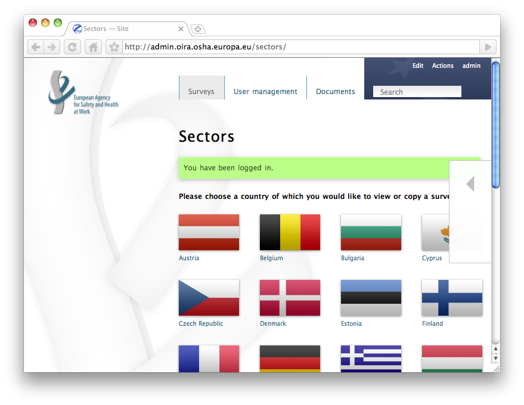
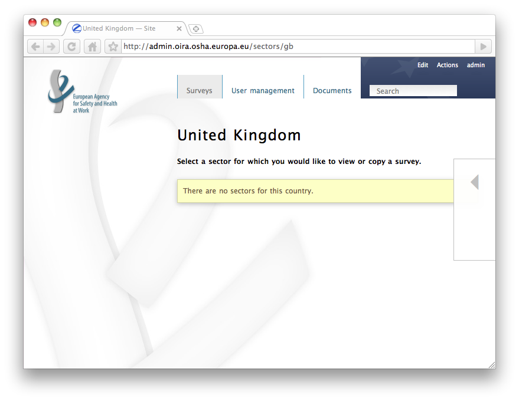
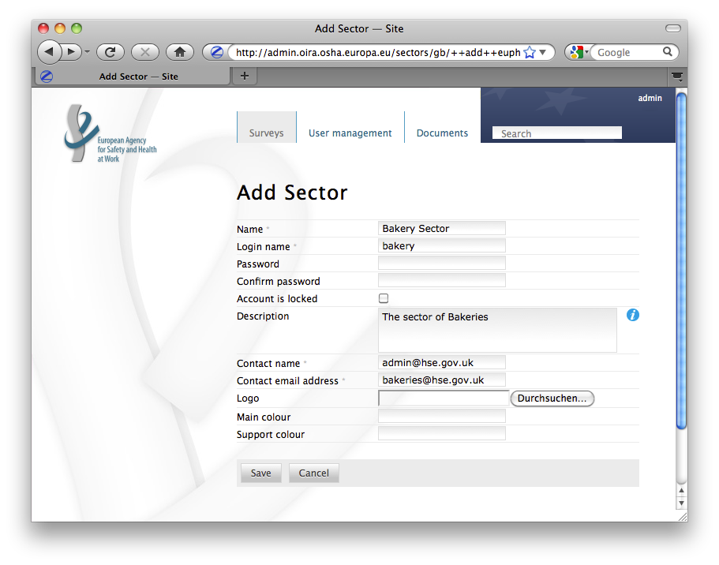
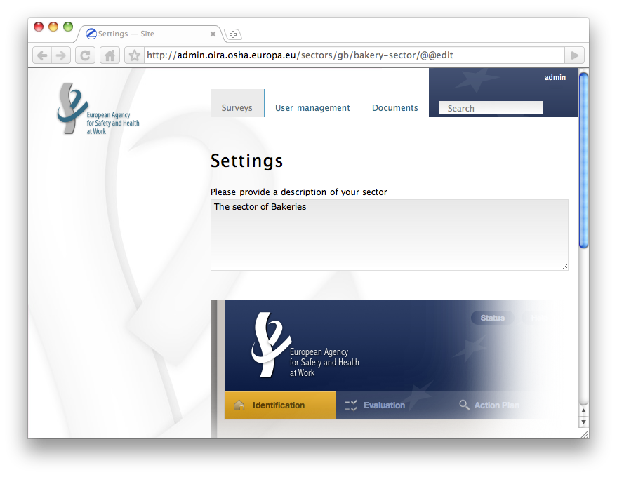
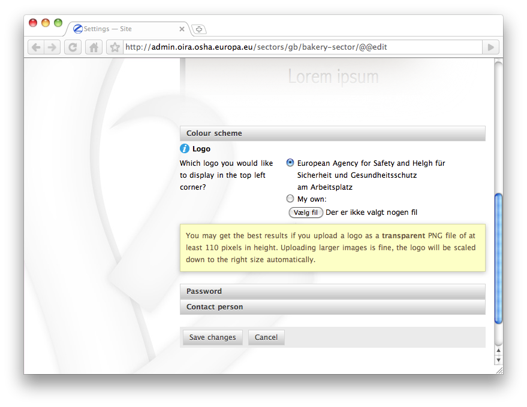
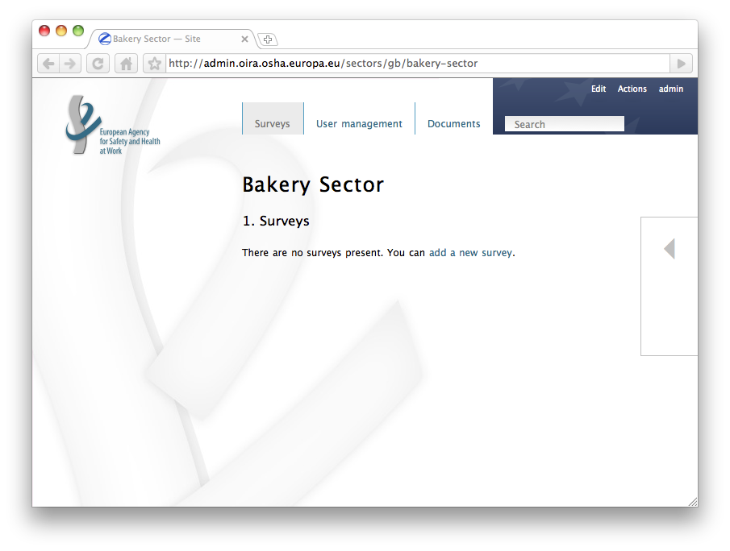

Admin manual
============

This document explains how you can administer users and countries so that these users can start creating online surveys. 

Log-in
------

First you need to log in with an account with administrative privileges. Go to http://admin.oiraproject.eu/ and you are prompted with a login form:

.. image:: images/admin/admin_login.png

Type login and password and click **Login**.

Note that there is a link below the login button which allows you to request an account if you don't have one yet.

You can also change the language of the page by clicking the arrow on the right side of the page opening the language menu.

.. image:: images/admin/access_languages.png

It will slide open when you move your mouse over it:

.. image:: images/admin/access_languages_open.png

Structure
---------

Online Surveys are stored in a structured way. To access a survey, you have to first pick a country and then a sector. The sector contains surveys. Once you logged in, you see the available countries represented by their flag on the overview page. Clicking a flag leads you to the sector overview of this country. You see a link for each sector present in that country.

Countries
---------

You can add a new country by accessing the Actions menu in the top right section of the page.

* Go to the country overview page (e.g. by clicking **Surveys**)
* Move your mouse over **Actions** and in the section **Add new** select **Country**
* Provide a Title and a Description for the new country
* Click **Save**

**Note**: Usually adding a country would not be a day to day task and it also requires system intervention to provide the proper flag at this moment.

Click a country to access the list of sectors available there. In the beginning this will be empty.

Manage countries:

* If you log in using administrator credentials, you are directed to the overview page with all the flags for the countries. 
* Click on a flag and then click **Edit** in the top right area to manage this country.

Country manager
---------------

You can add a country manager to delegate the user administration for a country. The country manager has full control over all content and structure within that country. He will be able to add sectors and manage the users within that country.

Follow these steps to add a Country manager:

* Hover your mouse over **Actions** and in the section **Add new** click **Country manager**
* The **Add Country manager** form appears
* Fill in the fields
* *Note that you can lock the account initially. It will then be inaccessible until you unlock it later.*
* Click **Save**
* A feedback page states that the user has been created

.. image:: images/admin/admin_add_country_manager.png

You can now contact the responsible person - in this example the HSE Country admin - and communicate the credentials to log into the site.

**Note**: If the country administrator logs in, he will be directed directly to his country's overview page where he can start adding sectors. He will not see the flag overview page.

Add Documentation
-----------------

You can add country specific documentation.

* Hover your mouse over **Actions** and in the section **Add new** click **Documentation**
* Provide a **Title**
* Provide a **Description**
* Click **Save**

.. image:: images/admin/admin_add_documentation.png

**Note**: The documentation added here will be availabe in the **user frontend** and therefore must be targeted at the end user who will later fill in the surveys - not the content creator.

Within this documentation section, you can manage 

* The Appendix
  Pages created in the appendix folder are available via links in the footer of the online client.
* The Online help text
  The online help text can also be modified.

*XXX TBD*

Sectors
-------

As Country manager you are responsible for the sectors. You can add and manage them.

Add a sector:

* Hover your mouse over **Actions** and in the section **Add new** click **Sector** 
* Provide a **Title** and an **ID** for this sector
* Provide a **password**. The sector manager will use this later to log into the sector
* Give a **description** for the sector. This will be displayed whenever the sector is shown
* Provide a **Contact name** and a **Contact email address** of the sector manager
* You can upload a **logo** of the sector and provide a **Main colour** and a **Support colour**. These will be used to customize the user interface in the client.
* Click **Save**

**Note**: The ID you chose will be the user name for the sector admin to log in with. The sector admin will use the ID and the password as credentials. Once logged in, he can then add and manage surveys.

Manage sectors:

* If you log in using your Country manager credentials, you are directed to an overview page with all the sectors in your country. 
* Click on a sector and then click **Edit** in the top right area to manage this sector.

Within the sector edit form, you can configure your sector further

*Edit the Description*

.. image:: images/admin/admin_edit_sector2.png

*Edit the color scheme*

*Upload your own logo*

.. image:: images/admin/admin_edit_sector4.png

*Pick a new password*

.. image:: images/admin/admin_edit_sector5.png

*Edit the Contact name and email*

User management
---------------

In the user management you are able to edit existing Sectors and Country managers. You can also add a new country manager or a new sector to your country.

.. image:: images/admin/admin_manage_users.png

Clicking the **Lock** button deactivates an account temporarily without the need to delete it.

Surveys
-------

As sector manager you are responsible for the surveys in your sector. You can add and manage them. In a newly created sector there are no surveys. You can either use the **Actions** dropdown or the link **add a new survey** in the content area.

Read the next chapter, `the content editor manual`_, on how to add and edit surveys.

.. _`the content editor manual`: editor.html

 
